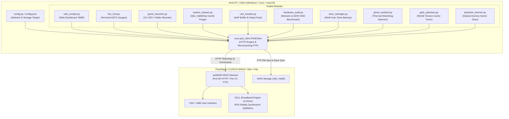

# PS3 Mission Control

[](https://www.python.org/)
[-003791.svg?style=flat&logo=playstation&logoColor=white)](https://www.psx-place.com/)
[](https://github.com/aldostools/webMAN-MOD)
[](LICENSE)
[]()

**PS3 Mission Control** is a lightweight, zero-dependency remote management toolkit and real-time hardware telemetry dashboard for PlayStation 3 consoles running custom firmware (CFW) or PS3HEN with **webMAN MOD**.

It interfaces directly with the console over local network via webMAN's HTTP API and FTP server to provide hardware monitoring, memory management, game mounting, storage audits, and automated save data backups from any PC or mobile device.

---

## System Architecture



---

## Features

### 1. Cyberpunk Web Cockpit (`tools/web_cockpit.py`)
- Dark-themed web dashboard hosted on `http://localhost:8080` (accessible via smartphone or local LAN).
- Real-time gauge tracking for CELL (CPU) and RSX (GPU) temperatures, dynamic fan duty cycle, and free VSH RAM.
- Live library scanner displaying all installed `PS3ISO` images and folder games with one-click mounting.
- Remote TV notification dispatcher (OSD popup) and manual memory flush triggers.

### 2. Live Terminal HUD (`tools/live_hud.py`)
- ANSI/ASCII terminal HUD refreshing at 1.5s intervals with dynamic colored status bars.
- Thermal threshold coloring: Green (<65°C), Yellow (65–73°C), Red (≥74°C).
- Tracks console uptime, free memory, and currently mounted disc image.

### 3. Interactive CLI Game Launcher (`tools/game_launcher.py`)
- Dynamically queries `/dev_hdd0/PS3ISO` and `/dev_hdd0/GAMES` via FTP.
- Keypad selection to mount games immediately via webMAN HTTP without browsing through XMB submenus.

### 4. VSH Memory Turbo (`tools/ram_booster.py`)
- Flushes lwIP TCP/IP network socket queues and purges VSH heap buffers (`/mem.ps3` & `/vshmem.ps3`).
- Reclaims system RAM overhead before launching demanding game engines.

### 5. Storage Cache Cleaner (`tools/system_cleaner.py`)
- Traverses `/dev_hdd0/tmp` while protecting critical webMAN assets (`wm_res`, `wm_icons`, `game_plugin`).
- Safely purges leftover web cache, error logs, and temporary dump files.

### 6. Multi-Profile Save Backup (`tools/save_manager.py`)
- Auto-detects all local PS3 user profiles under `/dev_hdd0/home/` (e.g. `00000001`, `00000058`).
- Hierarchically mirrors all save game directories to `./backups/saves/<user_id>/<title_id>/`.

### 7. Hardware & Storage Integrity Benchmark (`tools/hardware_audit.py`)
- **Network Concurrency Test:** Dispatches burst HTTP requests to evaluate socket response latency and packet loss.
- **SATA HDD Cryptographic Benchmark:** Writes and reads an 8 MB randomized binary block directly on `/dev_hdd0`, measures read/write throughput in MB/s, and performs a SHA-256 integrity comparison to detect bad sectors or storage corruption.
- **Thermal Efficiency Check:** Reads silicon temperatures under sustained I/O load.

### 8. Ghost Sentinel Watchdog (`tools/ghost_sentinel.py`)
- Standalone background daemon polling console vitals at configurable intervals.
- Triggers on-screen TV warnings if silicon temperatures exceed warning (70°C) or critical (76°C) thresholds.

### 9. GTA 5 RAGE Engine Tuner (`tools/gta5_optimizer.py`)
- Diagnoses game data across `BLUS31156`, `BLES01807`, and `BLES02011`.
- Purges stalled cache locks in game directories to prevent texture streaming pop-in during high-speed vehicle driving in Los Santos.

### 10. Blu-ray Phantom Padding Analyzer (`tools/phantom_trimmer.py`)
- Inspects disc images in `/dev_hdd0/PS3ISO`.
- Samples tail sectors to detect Sony dual-layer optical dummy padding (often wasting 4–6 GB per disc image), calculating potential storage savings.

### 11. Real-Hardware 60 FPS Patches (`patches/`)
- Includes verified Artemis memory patch files for *The Last of Us* (BCUS98174 v01.11).
- Technical documentation detailing how memory hook `0x01571A6F` removes the 33.3ms frame cap and explains RSX hardware fillrate limitations during gameplay vs. loading screens (100 FPS).

---

## Getting Started

### Prerequisites
- **Python 3.8+** (no pip packages required; utilizes Python standard library).
- **PlayStation 3** with Custom Firmware (CFW) or PS3HEN.
- **webMAN MOD** installed and running (ports 80 and 21 open).
- PC and PS3 connected to the same local subnet.

### Installation

```bash
git clone https://github.com/muhammetmucahitsoylu/ps3-mission-control.git
cd ps3-mission-control
```

### Configuration

Copy `config.example.json` to `config.json` and set your console's local IP address:

```json
{
  "ps3_ip": "<PS3_IP>",
  "webman_http_port": 80,
  "webman_ftp_port": 21,
  "web_cockpit_port": 8080,
  "backup_directory": "backups",
  "request_timeout_sec": 4.0,
  "thermal_warning_threshold_c": 70,
  "thermal_critical_threshold_c": 76
}
```

Alternatively, override via environment variable:

```bash
# Windows PowerShell
$env:PS3_IP="<PS3_IP>"

# Linux / macOS
export PS3_IP="<PS3_IP>"
```

### Usage

**Windows:** Double-click any of the numbered `.bat` files in the root folder or `scripts/` directory:
- `0_CANLI_WEB_KOKPIT.bat` - Launch Web Dashboard & open browser
- `1_Canli_Donanim_HUD.bat` - Open real-time terminal telemetry HUD
- `2_Oyun_Baslat.bat` - Launch interactive game mounter
- `3_Sistem_Temizle.bat` - Clean temporary caches
- `4_Save_Yedekle.bat` - Backup save files to PC
- `5_Donanim_Testi.bat` - Run network & SATA HDD benchmark
- `6_RAM_Hizlandirici.bat` - Free VSH memory buffers
- `7_GHOST_SENTINEL.bat` - Start background thermal monitor
- `8_GTA5_MOTOR_HIZLANDIRICI.bat` - Optimize GTA 5 texture streaming
- `9_BLURAY_PHANTOM_TRIMMER.bat` - Scan ISOs for dummy padding

**Terminal (Cross-Platform):**
```bash
python tools/web_cockpit.py
python tools/live_hud.py
python tools/hardware_audit.py
```

---

## Copyright & Legal Notice

- **No Proprietary Assets:** This repository does not contain any Sony proprietary firmware files, lv0/lv1/lv2 keys, game executables (`EBOOT.BIN`, `SELF`), game archives (`.psarc`, `.rpf`), or copyrighted assets.
- **Homebrew Compatibility:** All operations rely strictly on public network protocols implemented by the open-source webMAN MOD project.
- **Trademark Disclaimer:** "PlayStation", "PS3", "CELL Broadband Engine", and "RSX" are registered trademarks of Sony Interactive Entertainment Inc. All game titles, logos, and brands are property of their respective owners. This project is an independent open-source tool suite and is not affiliated with, endorsed by, or sponsored by Sony Interactive Entertainment Inc. or any game publishers.

---

## License

This project is licensed under the [MIT License](LICENSE).
