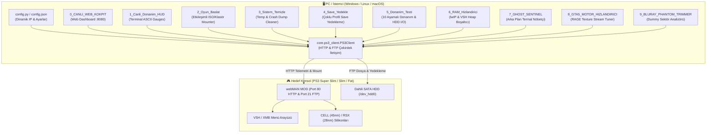

# 🎮 PS3 Mission Control Suite

[](https://www.python.org/)
[](https://opensource.org/licenses/MIT)
[-red.svg)](https://www.psx-place.com/)
[](https://github.com/aldostools/webMAN-MOD)
[]()

**PS3 Mission Control**, PlayStation 3 konsolları (CFW ve PS3HEN) için geliştirilmiş; gerçek zamanlı donanım izleme, Cyberpunk temalı web kokpiti, dinamik oyun başlatıcı, VSH RAM turbo temizliği, GTA 5 RAGE motoru optimizasyonu ve donanım doğrulama araçları sunan yeni nesil bir yönetim kütüphanesidir.

> [!NOTE]
> Proje **saf Python standart kütüphanesi** (`urllib`, `ftplib`, `socket`, `hashlib`, `json`, `threading`) ile geliştirilmiştir. Ekstra hiçbir `pip` paketine veya sürücüye ihtiyaç duymaz; çift tıklandığı anda çalışır.

---

## 🏛️ Mimari Şeması (Architecture)



---

## ✨ Temel Özellikler

### 1. Cyberpunk Web Kokpiti (`0_CANLI_WEB_KOKPIT.bat` / `web_cockpit.py`)
- Tarayıcı üzerinden (`http://localhost:8080`) veya yerel ağdaki telefon/tabletten erişilebilen fütüristik karanlık mod kontrol paneli.
- Canlı CELL/RSX sıcaklık göstergeleri, fan hızı ve anlık boş VSH RAM takibi.
- Yüklü ISO ve klasör oyunlarını tarayarak web üzerinden tek tıkla konsola takma (Mount).
- TV ekranına özel anlık bildirim (OSD Popup) gönderme ve uzaktan tek tuşla RAM boşaltma.

### 2. Canlı Terminal Donanım HUD (`1_Canli_Donanim_HUD.bat` / `live_hud.py`)
- Konsol açıkken bilgisayar ekranında gerçek zamanlı yenilenen renkli ASCII çubuk göstergeleri.
- 65°C üzeri sarı, 74°C üzeri kırmızı dinamik renk geçişleri.

### 3. Etkileşimli Oyun Başlatıcı (`2_Oyun_Baslat.bat` / `game_launcher.py`)
- `/dev_hdd0/PS3ISO` ve `/dev_hdd0/GAMES` dizinlerindeki oyunları otomatik tespit eder.
- Numarayı yazıp Enter'a basıldığında webMAN üzerinden oyunu konsola takar ve TV'ye bildirim yollar.

### 4. Sistem ve Önbellek Temizleyici (`3_Sistem_Temizle.bat` / `system_cleaner.py`)
- `/dev_hdd0/tmp` altındaki bozulmuş geçici logları, tarayıcı artıklarını ve çökme dökümlerini siler.
- Geri kazanılan depolama alanını raporlar.

### 5. Oyun Kayıt (Save) Yedekleme Yöneticisi (`4_Save_Yedekle.bat` / `save_manager.py`)
- Konsoldaki tüm kullanıcı profillerini (`0000000X`) otomatik tarar.
- Save dosyalarını PC'deki `./backups/saves/` klasörüne hiyerarşik olarak yedekler.

### 6. Acımasız Donanım ve Disk Test Kiti (`5_Donanim_Testi.bat` / `hardware_audit.py`)
- **Ağ Soket Stres Testi:** webMAN çekirdeğine eşzamanlı paketler göndererek paket kaybı, ortalama yanıt süresi ve jitter analizi yapar.
- **SATA HDD I/O & SHA-256 Doğrulama:** Konsolun dahili sabit diskine rastgele test bloğu yazıp okur; okuma/yazma hızlarını (MB/s) hesaplar ve kriptografik SHA-256 hash doğrulamasıyla sektör bozulması olup olmadığını teyit eder.
- **Termal Verimlilik Raporu:** CELL ve RSX çiplerinin çalışma sıcaklıklarını değerlendirir.

### 7. Derin VSH RAM Turbo (`6_RAM_Hizlandirici.bat` / `ram_booster.py`)
- Ağ soket kuyruklarını (lwIP) ve VSH heap belleğini boşaltarak oyun motoruna maksimum bellek alanı açar.

### 8. Ghost Sentinel Termal Nöbetçi (`7_GHOST_SENTINEL.bat` / `ghost_sentinel.py`)
- Arka planda konsol sıcaklığını izler. Sıcaklık eşik değerlerini (varsayılan: 70°C / 76°C) aştığında anında TV ekranına ve terminale uyarı gönderir.

### 9. GTA 5 RAGE Motor & Streaming Hızlandırıcı (`8_GTA5_MOTOR_HIZLANDIRICI.bat` / `gta5_optimizer.py`)
- GTA 5 (`BLUS31156` / `BLES01807` / `BLES02011`) için RAGE motoru doku akışını (texture streaming) optimize eder.
- Askıda kalan geçici önbellek kilitlerini temizleyerek şehir içi sürüşlerdeki kaplama gecikmesini ve FPS düşüşlerini önler.

### 10. Blu-ray Hayalet Dolgu Analizörü (`9_BLURAY_PHANTOM_TRIMMER.bat` / `phantom_trimmer.py`)
- Sony'nin Blu-ray optik disk standartları gereği eklenen dış kenar boşluklarını (dummy padding) analiz eder.

### 11. Gerçek Donanım 60 FPS Yamaları (`patches/`)
- *The Last of Us* (BCUS98174 v01.11) için Artemis uyumlu test edilmiş 60 FPS kilitsiz yama kodu (`BCUS98174.ncl`).
- Yükleme ekranındaki 100 FPS kilitsiz motor davranışını ve PS3 donanım sınırlarını anlatan detaylı teknik rehber (`patches/README.md`).

---

## 🚀 Hızlı Başlangıç (Quick Start)

### Gereksinimler
1. **Python 3.8+** (Herhangi bir ek kütüphane kurmanız gerekmez).
2. **PS3 (CFW veya PS3HEN)** üzerinde **webMAN MOD** kurulu ve aktif olmalıdır (Port 80 ve 21 açık).
3. Bilgisayar ile konsol aynı yerel ağda (Wi-Fi veya Ethernet) olmalıdır.

### Kurulum ve Yapılandırma
1. Depoyu klonlayın veya indirin:
   ```bash
   git clone https://github.com/muhammetmucahitsoylu/ps3-mission-control.git
   cd ps3-mission-control
   ```
2. Konsol IP adresinizi belirleyin:
   - `config.example.json` dosyasını `config.json` olarak kopyalayın ve PS3 IP adresinizi yazın:
     ```json
     {
       "ps3_ip": "<PS3_IP>"
     }
     ```
   - Veya ortam değişkeni (Environment Variable) tanımlayın:
     ```bash
     # Windows (PowerShell)
     $env:PS3_IP="<PS3_IP>"
     ```

3. İstediğiniz aracı başlatın:
   - **Windows:** İlgili `.bat` dosyasına çift tıklayın (örn: `0_CANLI_WEB_KOKPIT.bat`).
   - **Terminal / Linux / Mac:**
     ```bash
     python tools/web_cockpit.py
     python tools/live_hud.py
     ```

---

## 🔒 Gizlilik, Güvenlik ve Lisans

- **Kişisel Veri Yalıtımı:** Proje hiçbir kullanıcı adı, yerel disk yolu (`C:\Users\...`) veya konsol kimlik bilgisi (IDPS/PSID) barındırmaz.
- **Telif Hakkı Koruması:** Telifli oyun binary'leri (`EBOOT.BIN`, `.pkg`, `.iso`) veya özel kayıt dosyaları repoya dahil edilmez.
- **Lisans:** Bu proje [MIT Lisansı](LICENSE) kapsamında açık kaynak olarak dağıtılmaktadır.
